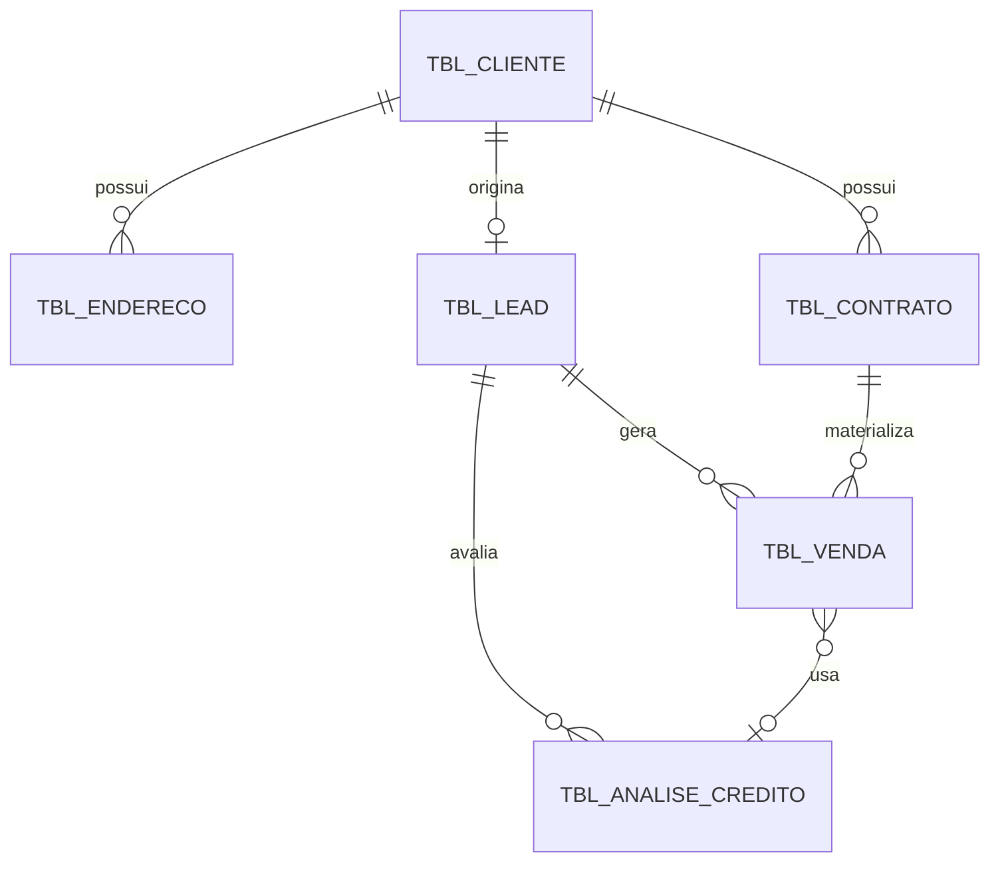

---
tags:
  - trabalho
  - air
  - comercial-api
  - dados
---
# Contratos de Dados - comercial-api

Contratos das tabelas centrais do domínio comercial. O objetivo é responder, por tabela: o que representa, quais campos importam, quais endpoints/queries usam, quais dados são sensíveis e quais cuidados existem ao alterar.

## Tabelas documentadas

| Tabela | Domínio | Contrato |
|---|---|---|
| `tbl_cliente` | Cliente | [[tbl_cliente]] |
| `tbl_endereco` | Endereço/viabilidade | [[tbl_endereco]] |
| `tbl_contrato` | Contrato/serviço | [[tbl_contrato]] |
| `tbl_lead` | Lead/prospecção | [[tbl_lead]] |
| `tbl_venda` | Venda/ativação/migração | [[tbl_venda]] |
| `tbl_analise_credito` | Crédito/restrição | [[tbl_analise_credito]] |

## Relação macro

## Cuidados globais

- Campos de documento, contato, endereço, credencial e crédito não devem aparecer com valores reais em documentação.
- Alterações em `tbl_cliente`, `tbl_contrato`, `tbl_lead`, `tbl_venda` e `tbl_analise_credito` devem revisar [[Operacional/Dados Sensiveis]].
- Alterações que mudem índice/filtro devem revisar [[Operacional/Performance Queries]].
- Alterações que mudem escrita devem revisar [[Operacional/Mapa de Escrita]] e runbook do fluxo.
- Alterações em campos usados por integração devem revisar [[Dependencias e Integracoes]].
