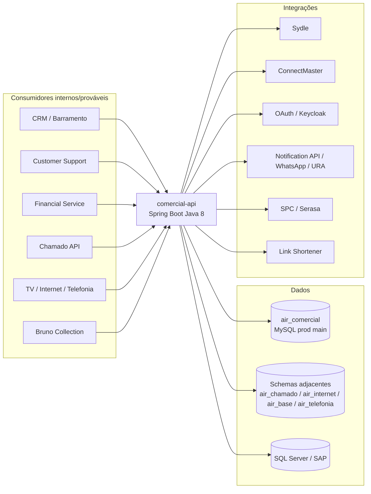

# Diagrama - contexto do serviço

```mermaid
flowchart LR
    subgraph Consumers[Consumidores internos/prováveis]
        CRM[CRM / Barramento]
        Support[Customer Support]
        Financial[Financial Service]
        Chamado[Chamado API]
        TV[TV / Internet / Telefonia]
        Bruno[Bruno Collection]
    end

    API[comercial-api\nSpring Boot Java 8]

    subgraph Data[Dados]
        MySQL[(air_comercial\nMySQL prod main)]
        Cross[(Schemas adjacentes\nair_chamado / air_internet / air_base / air_telefonia)]
        SQLServer[(SQL Server / SAP)]
    end

    subgraph External[Integrações]
        Sydle[Sydle]
        ConnectMaster[ConnectMaster]
        Keycloak[OAuth / Keycloak]
        Notification[Notification API / WhatsApp / URA]
        SPC[SPC / Serasa]
        Link[Link Shortener]
    end

    CRM --> API
    Support --> API
    Financial --> API
    Chamado --> API
    TV --> API
    Bruno --> API

    API --> MySQL
    API --> Cross
    API --> SQLServer
    API --> Sydle
    API --> ConnectMaster
    API --> Keycloak
    API --> Notification
    API --> SPC
    API --> Link
```

## Referências

- [[../Service Catalog]]
- [[../Dependencias e Integracoes]]
- [[../Ownership e Operacao]]
