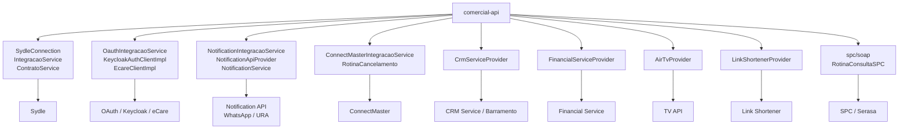

# Diagrama - dependências externas

```mermaid
flowchart TB
    API[comercial-api]

    API --> SydleConn[SydleConnection\nIntegracaoService\nContratoService]
    SydleConn --> Sydle[Sydle]

    API --> OAuthSvc[OauthIntegracaoService\nKeycloakAuthClientImpl\nEcareClientImpl]
    OAuthSvc --> Keycloak[OAuth / Keycloak / eCare]

    API --> NotifSvc[NotificationIntegracaoService\nNotificationApiProvider\nNotificationService]
    NotifSvc --> Notification[Notification API\nWhatsApp / URA]

    API --> CMSvc[ConnectMasterIntegracaoService\nRotinaCancelamento]
    CMSvc --> ConnectMaster[ConnectMaster]

    API --> CrmProvider[CrmServiceProvider]
    CrmProvider --> CRM[CRM Service / Barramento]

    API --> FinProvider[FinancialServiceProvider]
    FinProvider --> Financial[Financial Service]

    API --> TvProvider[AirTvProvider]
    TvProvider --> TV[TV API]

    API --> LinkProvider[LinkShortenerProvider]
    LinkProvider --> Link[Link Shortener]

    API --> SPCSoap[spc/soap\nRotinaConsultaSPC]
    SPCSoap --> SPC[SPC / Serasa]
```

## Referências

- [[../Dependencias e Integracoes]]
- [[../Operacional/Runbooks/Index]]
