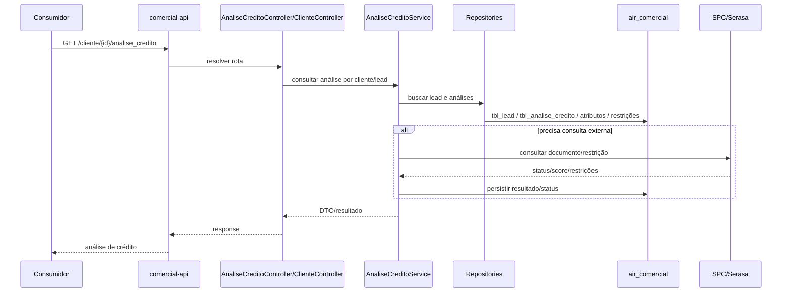

# Diagrama - fluxo de análise de crédito

## Pontos de atenção

- Fluxo de risco alto por documento, crédito e possível XML de retorno.
- O shape de SELECT é largo e contém campos sensíveis.
- Não usar payload real de cliente em documentação, issue ou teste versionado.

## Referências

- [[../Fluxos de Negocio/analise-credito]]
- [[../Operacional/Runbooks/analise-credito]]
- [[../Endpoints da Collection/get-cliente-analise-credito]]
- [[../Contratos de Dados/tbl_analise_credito]]
- [[../Resultados SELECT/analisecreditorepository-findallbyleadclienteid]]
