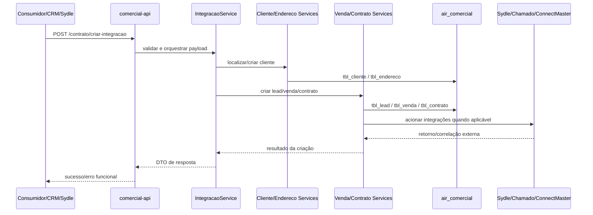

# Diagrama - fluxo de criação de contrato / integração

## Pontos de atenção

- Fluxo de risco alto.
- Escreve cliente, endereço, lead, venda e contrato.
- Pode acionar integrações externas.
- Deve ser tolerante a duplicidade/correlação externa quando possível.

## Referências

- [[../Fluxos de Negocio/criacao-integracao-contrato]]
- [[../Operacional/Runbooks/criacao-integracao-contrato]]
- [[../Endpoints da Collection/post-criar-integracao]]
- [[../Contratos de Dados/tbl_cliente]]
- [[../Contratos de Dados/tbl_contrato]]
- [[../Contratos de Dados/tbl_venda]]
