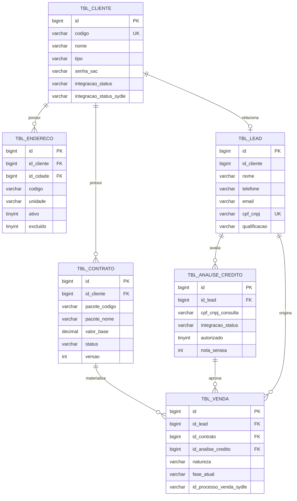

# Diagrama - modelo de domínio central

```mermaid
erDiagram
    TBL_CLIENTE {
        bigint id PK
        varchar codigo UK
        varchar nome
        varchar tipo
        varchar senha_sac
        varchar integracao_status
        varchar integracao_status_sydle
    }

    TBL_ENDERECO {
        bigint id PK
        bigint id_cliente FK
        bigint id_cidade FK
        varchar codigo
        varchar unidade
        tinyint ativo
        tinyint excluido
    }

    TBL_CONTRATO {
        bigint id PK
        bigint id_cliente FK
        varchar pacote_codigo
        varchar pacote_nome
        decimal valor_base
        varchar status
        int versao
    }

    TBL_LEAD {
        bigint id PK
        bigint id_cliente
        varchar nome
        varchar telefone
        varchar email
        varchar cpf_cnpj UK
        varchar qualificacao
    }

    TBL_ANALISE_CREDITO {
        bigint id PK
        bigint id_lead FK
        varchar cpf_cnpj_consulta
        varchar integracao_status
        tinyint autorizado
        int nota_serasa
    }

    TBL_VENDA {
        bigint id PK
        bigint id_lead FK
        bigint id_contrato FK
        bigint id_analise_credito FK
        varchar natureza
        varchar fase_atual
        varchar id_processo_venda_sydle
    }

    TBL_CLIENTE ||--o{ TBL_ENDERECO : possui
    TBL_CLIENTE ||--o{ TBL_CONTRATO : possui
    TBL_CLIENTE ||--o| TBL_LEAD : relaciona
    TBL_LEAD ||--o{ TBL_ANALISE_CREDITO : avalia
    TBL_LEAD ||--o{ TBL_VENDA : origina
    TBL_CONTRATO ||--o{ TBL_VENDA : materializa
    TBL_ANALISE_CREDITO ||--o{ TBL_VENDA : aprova
```

## Referências

- [[../Contratos de Dados/Index]]
- [[../Mapa de Dominio]]
